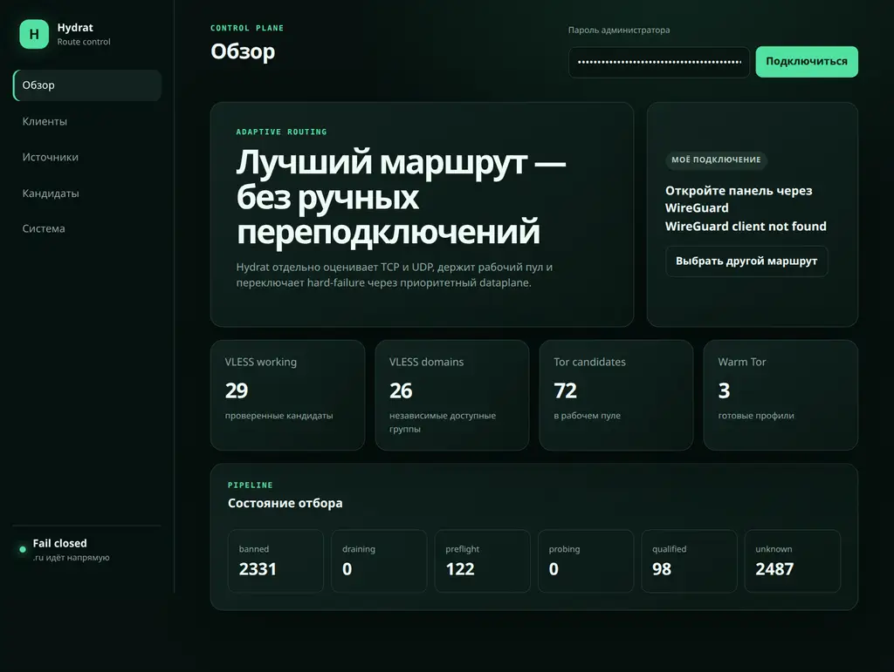
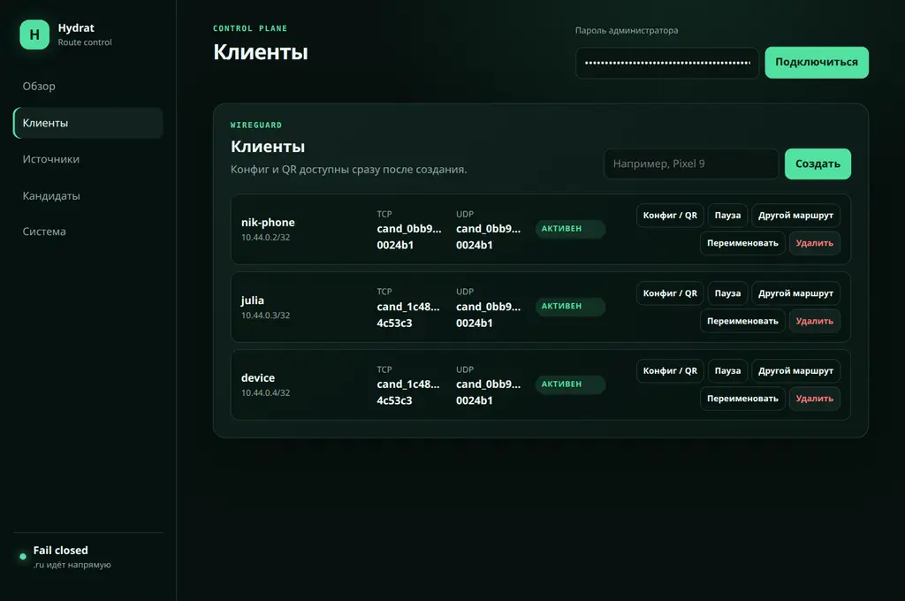
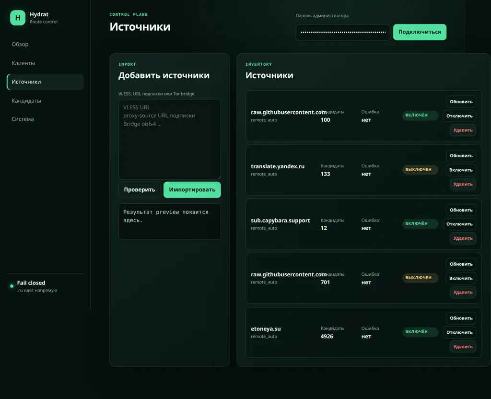
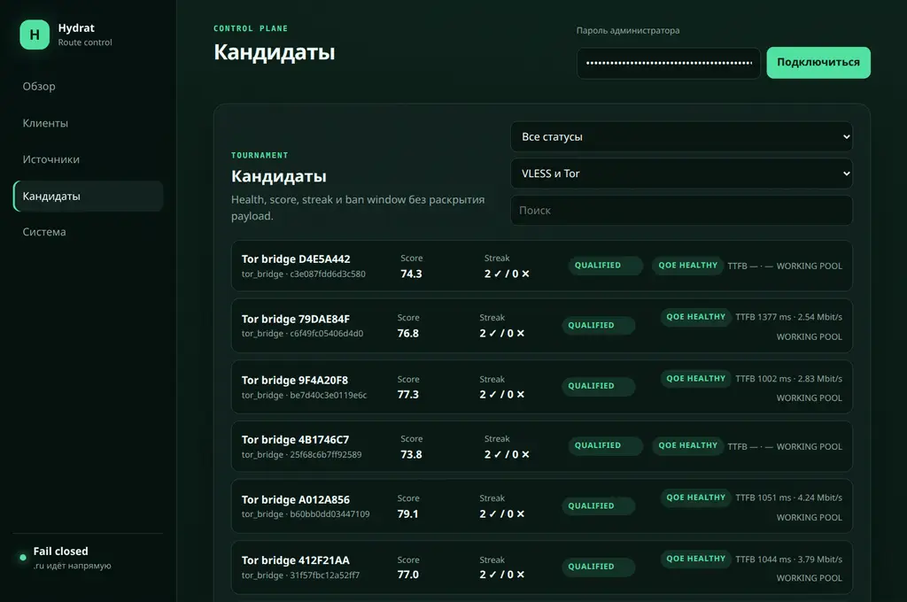

<p align="center">
  <a href="../../README.md">Русский</a> · <strong>English</strong> · <a href="../zh-CN/README.md">简体中文</a>
</p>

<p align="center">
  
</p>
<p align="center">
  <a href="https://golang.org"></a>
  <a href="../../LICENSE"></a>
  <a href="https://github.com/only-hydrat/hydrat/actions/workflows/ci.yml"></a>
  <a href="../../docker-compose.yml"></a>
</p>

<p align="center">
  <strong>A highly reliable intelligent VPN gateway powered by WireGuard, Xray, and Tor</strong><br>
  Automatic selection of the best VLESS and Tor proxies, background server qualification, failure isolation, and seamless switching without dropping the WireGuard tunnel.
</p>

<p align="center">
  <a href="#what-is-wrong-with-existing-solutions">Why Hydrat?</a> •
  <a href="#key-advantages">Advantages</a> •
  <a href="#interface">Interface</a> •
  <a href="#quick-start">Quick start</a> •
  <a href="#architecture-and-engineering">Architecture</a> •
  <a href="#operations-and-monitoring">Operations</a>
</p>

---

## What is wrong with existing solutions?

| Solution | Limitations and problems |
|---|---|
| **Vanilla WireGuard / OpenVPN** | Providers can quickly identify and block these protocols with DPI. |
| **Amnezia / Outline** | Tied to a single fixed IP address or server. If the address is blocked or the host fails, connectivity is lost completely and manual reconfiguration is required. |
| **Local clients (v2rayN, Happ, Hiddify, sing-box)** | • Continuous background measurements quickly drain smartphone batteries.<br>• A third-party application must be installed on every device.<br>• Configuration on home routers, Apple TV, and Smart TV is difficult or impossible.<br>• Subscriptions can contain thousands of broken or overloaded links, so a failed server requires manually opening the application and trying nodes one by one. |

### The Hydrat solution

**Hydrat combines the simplicity of WireGuard on the client with the power of Xray and Tor at the egress.**

Connect a phone, laptop, or home router to Hydrat with **standard native WireGuard**. The gateway runs on your VPS, loads your subscriptions containing thousands of VLESS and Tor servers, continuously tests them in isolated background environments, and routes traffic through the fastest and most stable proxy path.

**The key advantage is route switching without dropping the WireGuard tunnel.** When the current proxy fails, Hydrat sends new flows through a reserve route at the gateway. An established TCP or QUIC flow may still need to reconnect if its egress or public IP changes.

---

## Key advantages

### 1. Native WireGuard on every device
Connect with official WireGuard clients for iOS, Android, macOS, Windows, and Linux, or with Keenetic, OpenWrt, and Mikrotik routers. No complex third-party proxy applications and minimal smartphone battery use.

### 2. VLESS preferred over Tor by default
Normal placement prefers an eligible VLESS route for TCP. For a VLESS primary, the reserve prefers VLESS from another failure domain, but it may use a warmed Tor route if that is the only domain-safe option. During emergency replacement, eligible warmed VLESS and Tor routes are compared by failure domain, load, and score. UDP remains VLESS-only.

### 3. Coordinated TCP and UDP placement
When a UDP-qualified VLESS route is available, the scheduler attempts to co-assign it for both TCP and UDP. TCP and UDP may use different routes: TCP can use Tor, while UDP can use only a UDP-qualified VLESS route.

### 4. Automatic tournament selection
The gateway can store up to 10,000 candidates from public and private subscriptions. A background pipeline runs them through a two-stage tournament:

- **Fast Probe:** quick port and handshake availability check with a 6-second timeout.
- **Full Probe:** end-to-end data transfer and required service-gate verification with a 20-second timeout.
- Servers receive a dynamic `Score` based on latency, throughput, and stability. Three consecutive failures ban a bad node for five hours.

### 5. Failure-domain isolation
If 50 subscription entries point to the same server or CDN front, that server going down must not look like 50 independent failures. Hydrat groups routes into failure domains and ensures that a reserve comes from **another independent domain**.

### 6. Quality of Experience and configurable service gates
Active monitoring continuously evaluates the real user experience:

- Measures actual TTFB and sustained throughput with a 256 KiB sample download.
- Checks key services by default: YouTube, Instagram, Telegram Web/MTProto, ChatGPT, and the OpenAI API.
- **Configurable endpoints and custom gates:** `probes.gate_endpoints` and `probes.custom_gates` in `config.yml` can override probe addresses and add APIs or websites with specified acceptable HTTP statuses.
- Verifies QUIC / HTTP/3 over SOCKS5 UDP.
- Prevents flapping with hysteresis: a random short-lived latency fluctuation does not trigger a switch, and an alternative must demonstrate at least a 30% confirmed throughput advantage.

### 7. Smart direct routing and geo data

- **Direct access to Russian services:** traffic to `.ru`, `.su`, and `.рф` (`.xn--p1ai`) suffixes, as well as configured Russian services in international zones such as `thecode.media`, `habr.com`, and `direct_domains`, is routed directly. This avoids failures caused when anti-abuse systems reject foreign datacenter addresses.
- **Current GeoIP and GeoSite data:** the gateway can periodically download [runetfreedom/russia-blocked-geosite](https://github.com/runetfreedom/russia-blocked-geosite) and [runetfreedom/russia-blocked-geoip](https://github.com/runetfreedom/russia-blocked-geoip). Russian resources (`geosite:category-ru`, `geoip:ru`) go directly, while blocked resources (`geosite:russia-blocked`, `geoip:russia-blocked`) are forced through a working VLESS or Tor proxy.
- **Fail-closed protection:** all other untrusted traffic is routed through a proxy or blocked when no route is available, preventing source-IP leaks.
- **Russian egress protection:** `disallow_ru_egress: true` excludes egress servers located in Russia from qualification, keeping sensitive traffic away from nodes exposed to local censorship and blocking.

---

## Interface

The administration portal is available inside the VPN at `http://10.44.0.1/`. On the host, Compose publishes it only on `127.0.0.1:8088` by default. Use WireGuard or an authenticated HTTPS reverse proxy for external access. Never expose the portal directly as `0.0.0.0:8088`.

### 1. Dashboard
Statistics for active VLESS servers, available failure domains, ready Tor profiles, and the selection pipeline:

<p align="center">
  
</p>

### 2. Client management
Create client profiles, inspect assigned TCP/UDP routes, and generate configuration files and QR codes for mobile devices:

<p align="center">
  
</p>

### 3. Sources and subscriptions
Add VLESS, Tor, Happ, v2rayN, and Clash YAML subscriptions, preview valid candidates, and refresh them manually or automatically:

<p align="center">
  
</p>

### 4. Candidate tournament table
Inspect server test results, quality scores, success streaks, QoE state, TTFB, and throughput:

<p align="center">
  
</p>

---

## Quick start

Deployment is intentionally simple and requires no manual setup scripts.

### System requirements

- A Linux server such as Ubuntu 22.04 / 24.04 or Debian 12.
- Docker Engine and Docker Compose v2.
- Access to `/dev/net/tun`, normally available on KVM and dedicated servers.
- An open inbound `51820/udp` port.
- Recommended resources: at least 1–2 vCPU and 1 GiB of RAM.

### Step 1. Clone the repository

```bash
git clone https://github.com/only-hydrat/hydrat.git
cd hydrat
```

### Step 2. Configure `.env`

Create `.env` from the example:

```bash
cp .env.example .env
```

Open `.env` in a text editor and set:

```dotenv
# Public IP address or domain and WireGuard UDP port
WIREGUARD_ENDPOINT=203.0.113.10:51820

# Keep localhost; use WireGuard or an HTTPS proxy for external access
PORTAL_BIND_ADDRESS=127.0.0.1

# Host port for the administration portal (default: 8088)
PORTAL_PORT=8088

# Administration portal password
HYDRAT_ADMIN_PASSWORD=choose_a_strong_password
```

> **Note:** if a subscription requires Happ hardware-key verification, uncomment and set `HYDRAT_HWID`.

### Step 3. Start Hydrat

By default, Hydrat pulls and runs the official prebuilt public image `ghcr.io/only-hydrat/hydrat:1.0.7`:

```bash
docker compose up -d
```

> **Note:** you can override the image and version using `HYDRAT_IMAGE` in `.env` (e.g. `HYDRAT_IMAGE=ghcr.io/only-hydrat/hydrat:1.0.7`).

### Build from source (development)

If you are modifying the source code, use the `docker-compose.dev.yml` override:

```bash
docker compose -f docker-compose.yml -f docker-compose.dev.yml up -d --build
```

This builds one local `hydrat:dev` image for both services.

**Done.** The service automatically:

- Generates the WireGuard server private key in `data/wireguard/wg0.conf` with mode `0600`.
- Creates SQLite and `data/controller/secrets/master.key` with mode `0600` for field-level AES-GCM protection of sensitive payloads. This is not full-database encryption and does not protect against host-root access.
- Applies nftables routing rules and starts Xray and Tor.

---

## Connect in two minutes

1. **Open the administration portal:** before creating the first WireGuard client, create an SSH tunnel from your computer:
   ```bash
   ssh -N -L 8088:127.0.0.1:8088 <user>@<your-server-IP>
   ```
   Keep the SSH session open and visit `http://127.0.0.1:8088/`. After creating a client, use `http://10.44.0.1/` through WireGuard or an HTTPS reverse proxy. The browser sends the password once, keeps the Bearer session only in memory, and ends it on logout or controller restart.
2. **Add a subscription:** open **Sources**, select **Add sources**, paste a VLESS or Tor subscription URL, and select **Import**. Background qualification starts immediately.
3. **Create a connection:** open **Clients**, enter a device name such as `phone`, and select **Create**. Scan the QR code with WireGuard or download the `.conf` file.
4. **Verify connectivity:** enable the tunnel in WireGuard. The portal is now also available at `http://10.44.0.1/`.

---

## Architecture and engineering

```text
                            [ WireGuard client ]
                                      │
                         WireGuard UDP (port 51820)
                                      ▼
  ┌─────────────────────────── Docker host ──────────────────────────┐
  │                                                                  │
  │  ┌───────────────────────────────┐  ┌──────────────────────────┐ │
  │  │ gateway container             │  │ controller container     │ │
  │  │ (network plane, NET_ADMIN)    │  │ (isolated control plane) │ │
  │  │                               │  │                          │ │
  │  │ • wg0 interface               │  │ • SQLite (WAL)           │ │
  │  │ • nftables fwmark routing     │  │ • Tournament Engine      │ │
  │  │ • Main Xray (client traffic)  │  │ • Scheduler & reserves   │ │
  │  │ • Probe Xray (background)     │  │ • Web UI portal          │ │
  │  │ • Active Xray (warm reserve)  │  │ • REST API               │ │
  │  │ • Tor / Lyrebird (bridges)    │  │                          │ │
  │  └───────────────▲───────────────┘  └────────────▲─────────────┘ │
  │                  │                               │               │
  │                  └───────── Unix socket ─────────┘               │
  │                            (agent.sock)                          │
  └─────────────────────────────────┬────────────────────────────────┘
                                    │
                         Dynamic route selection
                                    ▼
                    [ VLESS Reality / Tor proxies ]
```

### Isolated gateway and controller planes

1. **Gateway:** owns network privileges (`NET_ADMIN`) and manages WireGuard, nftables, Xray, and Tor. It is isolated from the user database and encryption master keys.
2. **Controller:** runs as an unprivileged user (`UID 10001`) in an isolated namespace with a `read_only: true` filesystem. It stores SQLite and performs ranking calculations.
3. The processes communicate only through the local Unix socket `/run/hydrat/agent.sock`.

### Three Xray planes for continuity

Regular testing of thousands of nodes must not affect client traffic, so Xray processes are separated:

- **Main Xray:** serves only real client traffic and is never restarted for probes.
- **Probe Xray:** an isolated temporary process for background candidate qualification; rotated every 250 probes to limit memory leaks.
- **Active Xray:** keeps reserve-server sockets warm for fast switching after a failure.

---

## Operations and monitoring

### Logs

The gateway writes structured logs with automatic rotation and removes records older than 72 hours from `${DATA_DIR:-./data}/logs`. Gateway and controller use separate log directories. Reading retained logs requires root or sudo access.

Show the last 100 lines:

```bash
sudo tail -n 100 "${DATA_DIR:-./data}/logs/gateway/gateway-current.log" \
  "${DATA_DIR:-./data}/logs/controller/controller-current.log"
```

Follow active logs:

```bash
sudo tail -F "${DATA_DIR:-./data}/logs/gateway/gateway-current.log" \
  "${DATA_DIR:-./data}/logs/controller/controller-current.log"
```

### Health and readiness

- **Liveness:**
  ```bash
  curl -s http://127.0.0.1:8088/api/health
  # {"status":"ok"}
  ```
- **Route and reserve readiness:**
  ```bash
  curl -s http://127.0.0.1:8088/api/ready
  # {"status":"ok"}
  ```

---

## Security

- **No default secrets:** the repository contains no preconfigured keys or passwords. Strong values are generated on first start.
- **Restricted permissions:** private-key configurations use mode `0600`. The controller container uses `no-new-privileges: true` and `read_only: true`.
- Backup and recovery procedures are documented in [`operations.md`](operations.md).
- See [`SECURITY.md`](SECURITY.md) for architecture protections and responsible vulnerability disclosure.

---

## Contributing

Contributions are welcome. Read [`CONTRIBUTING.md`](CONTRIBUTING.md) and the [`CODE_OF_CONDUCT.md`](CODE_OF_CONDUCT.md) before submitting changes.

---

## License

Distributed under the MIT License. See [`LICENSE`](../../LICENSE).
